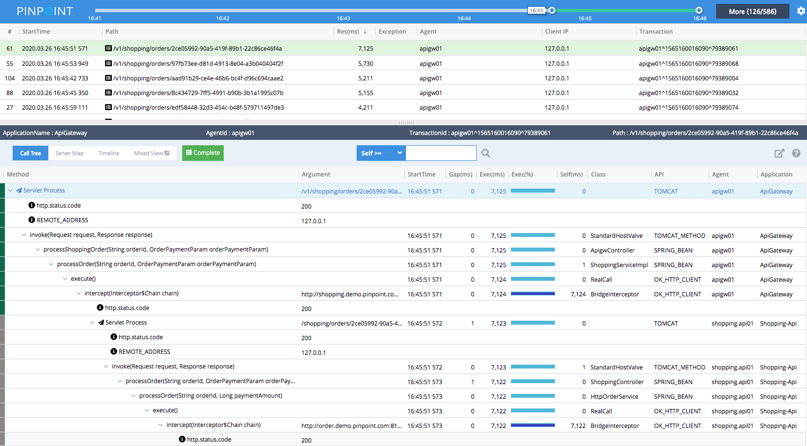

[](https://travis-ci.org/naver/pinpoint)
[](https://codecov.io/gh/naver/pinpoint)

**Pinpoint에 대한 자세한 정보와 [최신 업데이트](https://naver.github.io/pinpoint/news.html)를 보려면 당사 [공식 웹 사이트](http://naver.github.io/pinpoint/)를 방문하십시오.**

## Live Demo

새로운 UI(WIP)로 당사의 [데모](http://125.209.240.10:10123/v2/main/ApiGateway@SPRING_BOOT/5m?inbound=1&outbound=4&wasOnly=false&bidirectional=false)를 통해 Pinpoint를 간단히 살펴보십시오!

## 최근 소식 (2018/08/30)

Pinpoint는 PHP로 작성된 애플리케이션을 지원하기 시작했다. [당사의 PHP-에이전트 저장소 확인하기](https://github.com/naver/pinpoint-c-agent).

## 최신 발매 (2019/09/18)

우리는 Pinpoint v1.8.5의 출시를 발표할 수 있어서 기쁘다.  
(https://github.com/naver/pinpoint/releases/tag/1.8.5)에서 출시 내용을 확인하세요.

현재 안정된 버전은 [v1.8.5](https://github.com/naver/pinpoint/releases/tag/1.8.5).

## Pinpoint에 관하여

**Pinpoint**는 Java/[PHP](https://github.com/naver/pinpoint-c-agent)로 작성된 대규모 분산시스템을 위한 APM 도구
[Dapper](http://research.google.com/pubs/pub36356.html "Google Dapper")에서 영감을 받음
Pinpoint는 시스템의 전체적인 구조와 분산된 애플리케이션 간의 트랜잭션을 추적하여 시스템 내의 구성요소가 상호 연결되는 방식을 분석하는 데 도움이 되는 솔루션을 제공한다.

당신은 **Pinpoint**를 확인해야한다. 

* 당신의 *[application topology](https://naver.github.io/pinpoint/overview.html#overview)* 을 한눈에 이해하기 원한다면
* *실시간으로* 당신의 application을 확인하기 위해
* 모든 트랜잭션에 대해 *코드 레벨 가시성* 확보하기 위해
* *한 줄의 코드 변경없이* APM 에이전트 설치하기 위해
* 성능에 미치는 영향을 최소화하기 위해

## 시작하기
 * [Quick-start guide](https://naver.github.io/pinpoint/1.7.3/quickstart.html) Pinpoint를 단순히 시험하기 위해
 * [Installation guide](https://naver.github.io/pinpoint/1.7.3/installation.html) 자세한 사용을 위해.

## 개요
오늘날 서비스는 종종 외부 서비스에 API 호출을 할 뿐만 아니라 그들끼리 의사소통하는 많은 다른 요소들로 구성되어 있다. 각 트랜잭션의 실행 방식은 종종 블랙박스로 남는다. Pinpoint는 이러한 요소들 간의 거래 흐름을 추적하고 문제 영역과 잠재적 병목 현상을 식별하기 위한 명확한 뷰를 제공한다.<br/>
자세한 내용은 *[Introduction to Pinpoint](http://naver.github.io/pinpoint/#want-a-quick-tour)* 동영상을 참조하십시오.

* **ServerMap** - 구성 요소가 상호 연결되는 방식을 시각화하여 분산 시스템의 토폴로지를 이해하십시오. 노드를 클릭하면 구성 요소에 대한 현재 상태 및 트랜잭션 수와 같은 상세 내역이 표시된다.
* **Realtime Active Thread Chart** - Application 내부릐 활성 스레드를 실시간으로 모니터링 된다.
* **Request/Response Scatter Chart** - 요청 수 및 응답 패턴을 시각화하여 잠재적인 문제를 식별하십시오. 트랜잭션 선택 시 **dragging over the chart**에 의한 추가 세부 정보

 

* **CallStack** - 단일 뷰에서 병목 현상 및 장애 지점을 식별하여 분산 환경의 모든 트랜잭션에 대한 코드 레벨 가시성을 확보하십시오.



* **Inspector** - CPU 사용량, 메모리/게이지 수집, TPS 및 JVM 인수와 같은 Application에 대한 추가 세부 정보를 확인하십시오.


## 지원하는 모듈
* JDK 6+
* [Tomcat 6/7/8/9](https://github.com/naver/pinpoint/tree/master/plugins/tomcat), [Jetty 8/9](https://github.com/naver/pinpoint/tree/master/plugins/jetty), [JBoss EAP 6/7](https://github.com/naver/pinpoint/tree/master/plugins/jboss), [Resin 4](https://github.com/naver/pinpoint/tree/master/plugins/resin), [Websphere 6/7/8](https://github.com/naver/pinpoint/tree/master/plugins/websphere), [Vertx 3.3/3.4/3.5](https://github.com/naver/pinpoint/tree/master/plugins/vertx), [Weblogic 10/11g/12c](https://github.com/naver/pinpoint/tree/master/plugins/weblogic), [Undertow](https://github.com/naver/pinpoint/tree/master/plugins/undertow)
* Spring, Spring Boot (Embedded Tomcat, Jetty, Undertow), Spring asynchronous communication
* Apache HTTP Client 3.x/4.x, JDK HttpConnector, GoogleHttpClient, OkHttpClient, NingAsyncHttpClient, Akka-http, Apache CXF
* Thrift Client, Thrift Service, DUBBO PROVIDER, DUBBO CONSUMER, GRPC
* ActiveMQ, RabbitMQ, Kafka
* MySQL, Oracle, MSSQL(jtds), CUBRID, POSTGRESQL, MARIA
* Arcus, Memcached, Redis([Jedis](https://github.com/naver/pinpoint/blob/master/plugins/redis), [Lettuce](https://github.com/naver/pinpoint/tree/master/plugins/redis-lettuce)), CASSANDRA, MongoDB, Hbase
* iBATIS, MyBatis
* DBCP, DBCP2, HIKARICP, DRUID
* gson, Jackson, Json Lib, Fastjson
* log4j, Logback

## 호환성

Pinpoint 실행에 필요한 Java 버전:

Pinpoint Version | Agent | Collector | Web
---------------- | ----- | --------- | ---
1.0.x | 6-8 | 6-8 | 6-8
1.1.x | 6-8 | 7-8 | 7-8
1.5.x | 6-8 | 7-8 | 7-8
1.6.x | 6-8 | 7-8 | 7-8
1.7.x | 6-8 | 8 | 8
1.8.0 | 6-10 | 8 | 8 
1.8.1+ | 6-11 | 8 | 8 

HBase 호환성 표:

Pinpoint Version | HBase 0.94.x | HBase 0.98.x | HBase 1.0.x | HBase 1.2.x | HBase 2.0.x
---------------- | ------------ | ------------ | ----------- | ----------- | -----------
1.0.x | yes | no | no | no | no
1.1.x | no | not tested | yes | not tested | no
1.5.x | no | not tested | yes | not tested | no
1.6.x | no | not tested | not tested | yes | no
1.7.x | no | not tested | not tested | yes | no
1.8.x | no | not tested | not tested | yes | no

Agent - Collector 호환성 표:

Agent Version | Collector 1.0.x | Collector 1.1.x | Collector 1.5.x | Collector 1.6.x | Collector 1.7.x | Collector 1.8.x
------------- | --------------- | --------------- | --------------- | --------------- | --------------- | ---------------
1.0.x | yes | yes | yes | yes | yes | yes
1.1.x | not tested | yes | yes | yes | yes | yes
1.5.x | no | no | yes | yes | yes | yes
1.6.x | no | no | not tested | yes | yes | yes
1.7.x | no | no | no | no | yes | yes
1.8.x | no | no | no | no | no | yes

Flink 호환성 표:

Pinpoint Version | flink 1.3.X | flink 1.4.X | flink 1.5.X | flink 1.6.X | flink 1.7.X
---------------- | ----------- | ----------- | ----------- | ----------- | ----------- 
1.7.x | yes | yes | no | no | no |
1.8.x | yes | yes | no | no | no |
1.9.x | yes | yes | yes | yes | yes |

## 사용자 그룹
Q/A 및 토론용 [여기](https://groups.google.com/forum/#!forum/pinpoint_user).

## LICENSE
Pinpoint는 Apache License version 2.0을 기반으로 한다.
LICENSE의 전문을 보려면 [LICENSE](LICENSE)

```
Copyright 2018 NAVER Corp.

Apache License 버전 2.0(이하 "라이센스")에 따라 라이센스가 부여됨;
이 파일은 라이센스 준수를 제외하고 사용할 수 없다.
License의 복사본을 얻으려면 
     
      http://www.apache.org/licenses/LICENSE-2.0

관련 법률에 의해 요구되거나 서면으로 합의되지 않는 한, 소프트웨어는
License에 따라 배포되는 "AS IS" BASIS,
명시적이거나 묵시적인 모든 KIND의 보증 또는 조건 없음.
사용 권한 및 제한에 대한 자세한 내용은 사용 권한 아래의 특정
언어에 대한 License를 참조하십시오.
```

