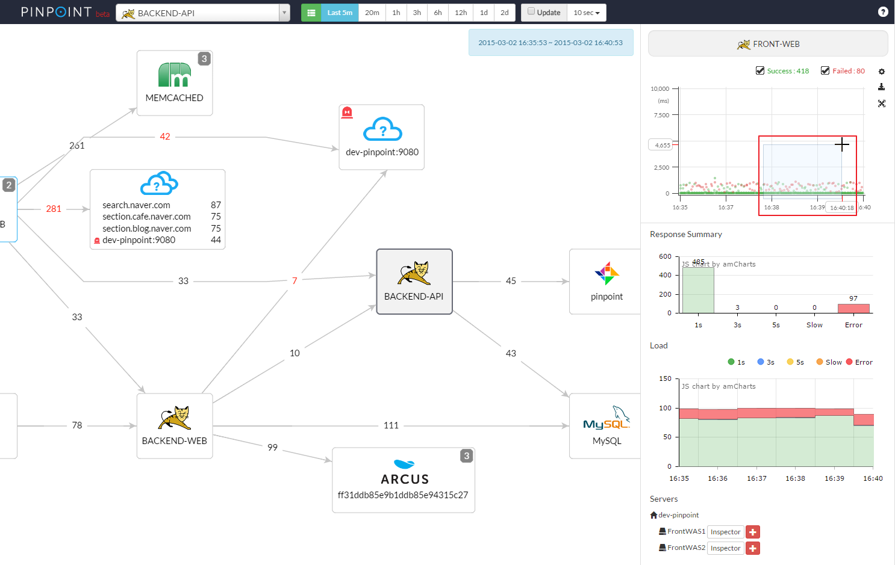
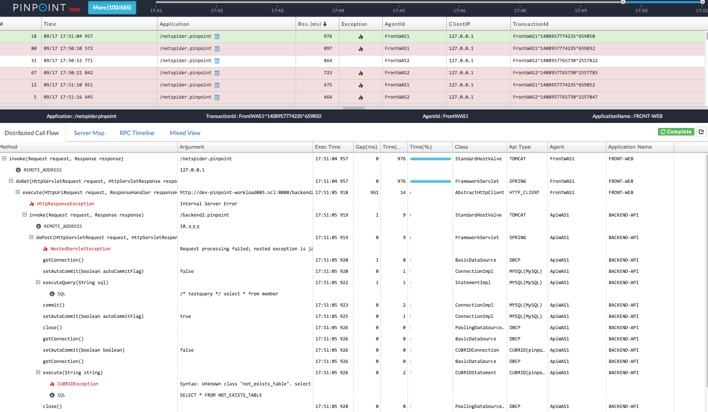
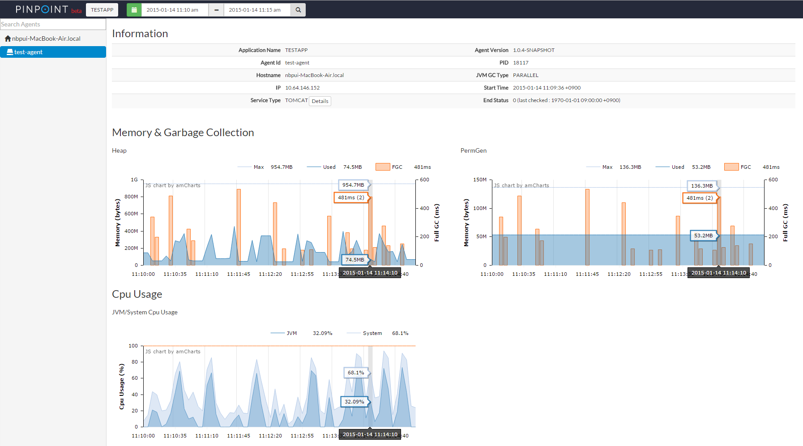

[](https://travis-ci.org/naver/pinpoint)

**Pinpoint** is an APM (Application Performance Management) tool for large-scale distributed systems written in Java. Modelled after [Google's Dapper paper](http://research.google.com/pubs/pub36356.html), Pinpoint provides a solution to help analyze the overall structure of the system and how components within them are interconnected by tracing transactions across distributed applications.

* Install agents without changing a single line of code
* Minimal impact on performance (approximately 3% increase in resource usage)

## Latest Release (2015/6/07)
We're happy to announce the release of Pinpoint **v1.1.0**. <br/>
Please check release note at (https://github.com/naver/pinpoint/releases/tag/1.1.0)

## Overview
Services nowadays often consist of many different components, communicating amongst themselves as well as making API calls to external services. How each and every transaction gets executed is often left as a blackbox. Pinpoint traces transaction flows between these components and provides a clear view to identify problem areas and potential bottlenecks.

* **ServerMap** - Understand the topology of any distributed systems by visualizing how their components are interconnected. Clicking on a node reveals details about the component, such as its current status, and transaction count.
* **Request/Response Scatter Chart** - Visualize request count and response patterns over time to identify potential problems. Transactions can be selected for additional detail by **dragging over the chart**.

  

* **CallStack** - Gain code-level visibility to every transaction in a distributed environment, identifying bottlenecks and points of failure in a single view.

  

* **Inspector** - View additional details on the application such as CPU usage, Memory/Garbage Collection, and JVM arguments.

  

## Architecture


## Supported Modules
* JDK 6+
* Tomcat 6/7
* Spring
* Apache HTTP Client 3.x/4.x, JDK HttpConnector
* MySQL, Oracle, MSSQL, CUBRID, DBCP
* iBATIS, MyBatis
* Arcus, Memcached, Redis

## Quick Start
You may run a sample Pinpoint instance in your own machine by running four simple scripts for each components: Collector, Web, Sample TestApp, HBase.

Once the components are running, you should be able to visit http://localhost:28080 to view the Pinpoint Web UI, and http://localhost:28081 to generate transactions on the Sample TestApp.

For details, please refer to the [quick-start guide](quickstart/README.md "Pinpoint quick-start guide").

## Installation
**Build Requirements**

* JDK 6 installed
* JDK 7+ installed
* Maven 3.2.x+ installed
* JAVA_6_HOME environment variable set to JDK 6 home directory.
* JAVA_7_HOME environment variable set to JDK 7+ home directory.

**Prerequisites**

Java version required to run Pinpoint:

Pinpoint Version | Agent | Collector | Web
---------------- | ----- | --------- | ---
1.0.x | 6+ | 6+ | 6+
1.1.x | 6+ | 7+ | 7+
1.5.x | 6+ | 7+ | 7+

HBase compatibility table:

Pinpoint Version | HBase 0.94.x | HBase 0.98.x | HBase 1.0.x | HBase 1.1.x
---------------- | ------------ | ------------ | ----------- | -----------
1.0.x | yes | no | no | no
1.1.x | no | not tested | yes | not tested
1.5.x | no | not tested | yes | not tested


**Installation**

To set up your very own Pinpoint instance you can either **download the build results** from our [**latest release**](https://github.com/naver/pinpoint/releases/latest), or manually build from your Git clone.
Take a look at our [installation guide](doc/installation.md) for further instructions.

## Issues
For feature requests and bug reports, feel free to post them [here](https://github.com/naver/pinpoint/issues).


## User Group
For Q/A and discussion [here](https://groups.google.com/forum/#!forum/pinpoint_user).


## Wiki
For roadmap, user guide, documentation.
We welcome any documentation contribution.
[here](https://github.com/naver/pinpoint/wiki).


## Contribution
We welcome any and all suggestions. Our development guide is currently WIP so check back often for any updates.

For contributions, please make a pull-request against our `master` branch.

We would love to see additional tracing support for libraries such as [Storm](https://storm.apache.org/), [HBase](http://hbase.apache.org/), as well as profiler support for additional languages (.NET, C++).

## License
Pinpoint is licensed under the Apache License, Version 2.0.
See [LICENSE](LICENSE) for full license text.

```
Copyright 2014 Naver Corp.

Licensed under the Apache License, Version 2.0 (the "License");
you may not use this file except in compliance with the License.
You may obtain a copy of the License at

    http://www.apache.org/licenses/LICENSE-2.0

Unless required by applicable law or agreed to in writing, software
distributed under the License is distributed on an "AS IS" BASIS,
WITHOUT WARRANTIES OR CONDITIONS OF ANY KIND, either express or implied.
See the License for the specific language governing permissions and
limitations under the License.
```
