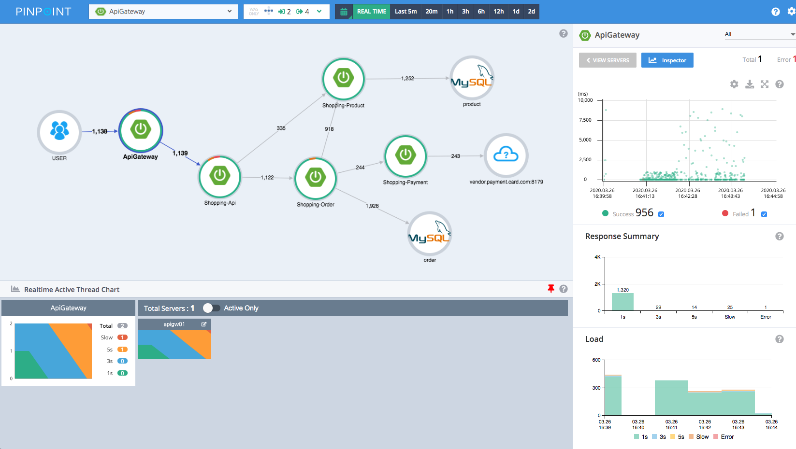

[](https://github.com/pinpoint-apm/pinpoint/actions?query=workflow%3AMaven)
[](https://codecov.io/gh/pinpoint-apm/pinpoint)

## Latest Release (2021/07/22)

We're happy to announce the release of Pinpoint v2.3.0.
Please check the release note at (https://github.com/pinpoint-apm/pinpoint/releases/tag/v2.3.0).

The current stable version is [v2.3.0](https://github.com/pinpoint-apm/pinpoint/releases/tag/v2.3.0).

## Live Demo

Take a quick look at Pinpoint with our [demo](http://125.209.240.10:10123/main/ApiGateway@SPRING_BOOT/5m?inbound=1&outbound=4&wasOnly=false&bidirectional=false)!

## PHP, PYTHON

Pinpoint also supports application written in PHP, Python. [Check-out our agent repository](https://github.com/pinpoint-apm/pinpoint-c-agent).

## About Pinpoint

**Pinpoint** is an APM (Application Performance Management) tool for large-scale distributed systems written in Java / [PHP](https://github.com/pinpoint-apm/pinpoint-c-agent)/[PYTHON]((https://github.com/pinpoint-apm/pinpoint-c-agent)).
Inspired by [Dapper](http://research.google.com/pubs/pub36356.html "Google Dapper"),
Pinpoint provides a solution to help analyze the overall structure of the system and how components within them are interconnected by tracing transactions across distributed applications.

You should definitely check **Pinpoint** out If you want to

* understand your *[application topology](https://pinpoint-apm.gitbook.io/pinpoint/want-a-quick-tour/overview)* at a glance
* monitor your application in *Real-Time*
* gain *code-level visibility* to every transaction
* install APM Agents *without changing a single line of code*
* have minimal impact on the performance (approximately 3% increase in resource usage)

## Getting Started
 * [Quick-start guide](https://pinpoint-apm.gitbook.io/pinpoint/getting-started/quickstart) for simple test run of Pinpoint
 * [Installation guide](https://pinpoint-apm.gitbook.io/pinpoint/getting-started/installation) for further instructions.
 
## Overview
Services nowadays often consist of many different components, communicating amongst themselves as well as making API calls to external services. How each and every transaction gets executed is often left as a blackbox. Pinpoint traces transaction flows between these components and provides a clear view to identify problem areas and potential bottlenecks.<br/>
For a more intimate guide, please check out our *[Introduction to Pinpoint](https://pinpoint-apm.gitbook.io/pinpoint/#want-a-quick-tour)* video clip.

* **ServerMap** - Understand the topology of any distributed systems by visualizing how their components are interconnected. Clicking on a node reveals details about the component, such as its current status, and transaction count.
* **Realtime Active Thread Chart** - Monitor active threads inside applications in real-time.
* **Request/Response Scatter Chart** - Visualize request count and response patterns over time to identify potential problems. Transactions can be selected for additional detail by **dragging over the chart**.

  

* **CallStack** - Gain code-level visibility to every transaction in a distributed environment, identifying bottlenecks and points of failure in a single view.

  

* **Inspector** - View additional details on the application such as CPU usage, Memory/Garbage Collection, TPS, and JVM arguments.

  

## Supported Modules
* JDK 7+
* [Tomcat 6/7/8/9](https://github.com/pinpoint-apm/pinpoint/tree/master/plugins/tomcat), [Jetty 8/9](https://github.com/pinpoint-apm/pinpoint/tree/master/plugins/jetty), [JBoss EAP 6/7](https://github.com/pinpoint-apm/pinpoint/tree/master/plugins/jboss), [Resin 4](https://github.com/pinpoint-apm/pinpoint/tree/master/plugins/resin), [Websphere 6/7/8](https://github.com/pinpoint-apm/pinpoint/tree/master/plugins/websphere), [Vertx 3.3/3.4/3.5](https://github.com/pinpoint-apm/pinpoint/tree/master/plugins/vertx), [Weblogic 10/11g/12c](https://github.com/pinpoint-apm/pinpoint/tree/master/plugins/weblogic), [Undertow](https://github.com/pinpoint-apm/pinpoint/tree/master/plugins/undertow)
* Spring, Spring Boot (Embedded Tomcat, Jetty, Undertow), Spring asynchronous communication
* Apache HTTP Client 3.x/4.x, JDK HttpConnector, GoogleHttpClient, OkHttpClient, NingAsyncHttpClient, Akka-http, Apache CXF
* Thrift Client, Thrift Service, DUBBO PROVIDER, DUBBO CONSUMER, GRPC
* ActiveMQ, RabbitMQ, Kafka, RocketMQ
* MySQL, Oracle, MSSQL(jtds), CUBRID, POSTGRESQL, MARIA
* Arcus, Memcached, Redis([Jedis](https://github.com/pinpoint-apm/pinpoint/blob/master/plugins/redis), [Lettuce](https://github.com/pinpoint-apm/pinpoint/tree/master/plugins/redis-lettuce)), CASSANDRA, MongoDB, Hbase, Elasticsearch
* iBATIS, MyBatis
* DBCP, DBCP2, HIKARICP, DRUID
* gson, Jackson, Json Lib, Fastjson
* log4j, Logback, log4j2

## Compatibility

Java version required to run Pinpoint:

Pinpoint Version | Agent | Collector | Web
---------------- | ----- | --------- | ---
1.7.x  | 6-8  | 8   | 8
1.8.0  | 6-10 | 8   | 8 
1.8.1+ | 6-11 | 8   | 8 
2.0.x  | 6-13 | 8   | 8
2.1.x  | 6-14 | 8   | 8
2.2.x  | 7-14 | 8   | 8
2.3.x  | 7-17 | 8   | 8

HBase compatibility table:

Pinpoint Version | HBase 1.0.x | HBase 1.2.x | HBase 1.4.x | HBase 2.0.x
---------------- | ----------- | ----------- | ----------- | -----------
1.7.x | not tested | yes | yes | no
1.8.x | not tested | yes | yes | no
2.0.x | not tested | yes | yes | [optional](https://pinpoint-apm.gitbook.io/pinpoint/documents/hbase-upgrade#do-you-like-to-use-hbase-2x-for-pinpoint)
2.1.x | not tested | yes | yes | [optional](https://pinpoint-apm.gitbook.io/pinpoint/documents/hbase-upgrade#do-you-like-to-use-hbase-2x-for-pinpoint)
2.2.x | not tested | yes | yes | [optional](https://pinpoint-apm.gitbook.io/pinpoint/documents/hbase-upgrade#do-you-like-to-use-hbase-2x-for-pinpoint)
2.3.x | not tested | yes | yes | [hbase2-module](https://github.com/pinpoint-apm/pinpoint/tree/master/hbase2-module)

Agent - Collector compatibility table:

Agent Version | Collector 1.7.x | Collector 1.8.x | Collector 2.0.x | Collector 2.1.x | Collector 2.2.x | Collector 2.3.x |
------------- | --------------- | --------------- | --------------- | --------------- | --------------- | --------------- |
1.7.x | yes | yes | yes | yes | yes | yes 
1.8.x | no  | yes | yes | yes | yes | yes 
2.0.x | no  | no  | yes | yes | yes | yes 
2.1.x | no  | no  | no  | yes | yes | yes 
2.2.x | no  | no  | no  | no  | yes | yes
2.3.x | no  | no  | no  | no  | no  | yes

Flink compatibility table:

Pinpoint Version | flink 1.3.X | flink 1.4.X | flink 1.5.X | flink 1.6.X | flink 1.7.X
---------------- | ----------- | ----------- | ----------- | ----------- | ----------- 
1.7.x | yes | yes | no | no | no |
1.8.x | yes | yes | no | no | no |
2.0.x | yes | yes | yes | yes | yes |
2.1.x | yes | yes | yes | yes | yes |
2.2.x | yes | yes | yes | yes | yes |
2.3.x | yes | yes | yes | yes | yes |


## Community

[Github issues](https://github.com/pinpoint-apm/pinpoint/issues)  
[Google group](https://groups.google.com/forum/#!forum/pinpoint_user)  
[Gitter](https://gitter.im/naver/pinpoint)  

We have Chinese community now, welcome to join!

QQ Group1: 897594820 | QQ Group2: 812507584 | DING Group : 21981598
:----------------: | :-----------: | :-----------: 
 |  | 


## License
Pinpoint is licensed under the Apache License, Version 2.0.
See [LICENSE](LICENSE) for full license text.

```
Copyright 2018 NAVER Corp.

Licensed under the Apache License, Version 2.0 (the "License");
you may not use this file except in compliance with the License.
You may obtain a copy of the License at

    http://www.apache.org/licenses/LICENSE-2.0

Unless required by applicable law or agreed to in writing, software
distributed under the License is distributed on an "AS IS" BASIS,
WITHOUT WARRANTIES OR CONDITIONS OF ANY KIND, either express or implied.
See the License for the specific language governing permissions and
limitations under the License.
```

