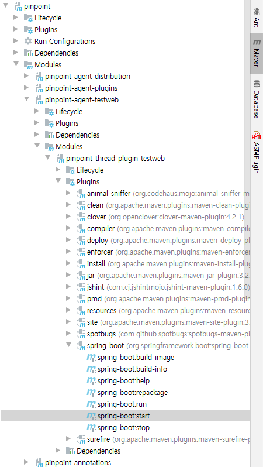

## Agent Testweb
Pinpoint-agent sample app

## Prerequirements
[Install pinpoint](../doc/installation.md#quick-overview-of-installation) and start [pinpoint-web](../web/README.md) and [pinpoint-collector](../collector/README.md)

## Sample App
[ThreadPlugin-Test](thread-plugin-test/README.md)

## Using IDE
When running the sample app in IDE, use the built-in maven feature

eg) IDEA

Maven-tab > $SAMPLE_APP > Plugins > spring-boot:start

