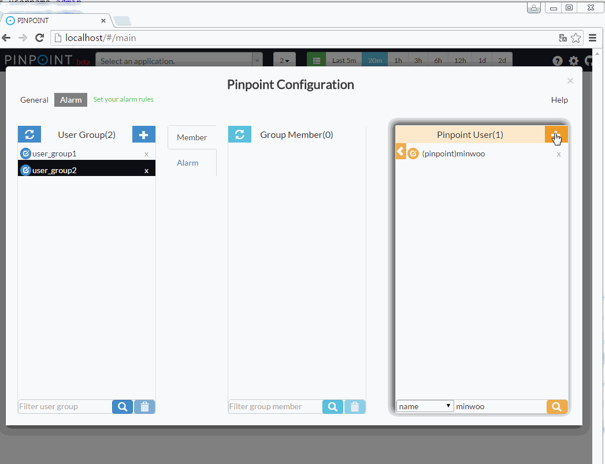

[English](#alarm) | [한글](#alarm-1)
# Alarm

Pinpoint-web periodically checks the applications' status and triggers an alarm if certain pre-configured conditions (rules) are met.

These conditions are (by default) checked every 3 minutes by a background batch process within the Web module, using the last 5 minutes of data. Once a condition is met, the batch process sends an sms/email to users registered to a user group.

## 1. User Guide

1) Configuration menu


2) Registering users


3) Creating user groups


4) Adding users to user group


5) Setting alarm rules


**Alarm Rules**
```
SLOW COUNT
   Triggered when the number of slow requests sent by the application exceeds the configured threshold.

SLOW RATE
   Triggered when the percentage(%) of slow requests sent by the application exceeds the configured threshold.

ERROR COUNT
   Triggered when the number of failed requests sent by the application exceeds the configured threshold.

ERROR RATE
   Triggered when the percentage(%) of failed requests sent by the application exceeds the configured threshold.

TOTAL COUNT
   Triggered when the number of all requests sent by the application exceeds the configured threshold.

SLOW COUNT TO CALLEE
   Triggered when the number of slow requests sent to the application exceeds the configured threshold.

SLOW RATE TO CALLEE
   Triggered when the percentage(%) of slow requests sent to the application exceeds the configured threshold.

ERROR COUNT TO CALLEE
   Triggered when the number of failed requests sent to the application exceeds the configured threshold.

ERROR RATE TO CALLEE
   Triggered when the percentage(%) of failed requests sent to the application exceeds the configured threshold.

TOTAL COUNT TO CALLEE
   Triggered when the number of all requests sent to the application exceeds the configured threshold.

HEAP USAGE RATE
   Triggered when the application's heap usage(%) exceeds the configured threshold.

JVM CPU USAGE RATE
   Triggered when the application's CPU usage(%) exceeds the configured threshold.

DATASOURCE CONNECTION USAGE RATE
   Triggered when the application's DataSource connection usage(%) exceeds the configured threshold.
```


## 2. Implementation & Configuration

In order to use the alarm function, you must implement your own logic to send sms and email by implementing `com.navercorp.pinpoint.web.alarm.AlarmMessageSender` and registering it as a Spring managed bean. When an alarm is triggered, `AlarmMessageSender#sendEmail`, and `AlarmMessageSender#sendSms` methods are called.

### 1) Implementing `AlarmMessageSender` and Spring bean registration
```
public class AlarmMessageSenderImple implements AlarmMessageSender {

    private final Logger logger = LoggerFactory.getLogger(this.getClass());

    @Autowired
    private UserGroupService userGroupService;
    
    @Override
    public void sendSms(AlarmChecker checker, int sequenceCount) {
        List<String> receivers = userGroupService.selectPhoneNumberOfMember(checker.getUserGroupId());

        if (receivers.size() == 0) {
            return;
        }

        for (String message : checker.getSmsMessage()) {
            logger.info("send SMS : {}", message);

            // TODO Implement logic for sending SMS
        }
    }

    @Override
    public void sendEmail(AlarmChecker checker, int sequenceCount) {
        List<String> receivers = userGroupService.selectEmailOfMember(checker.getUserGroupId());

        if (receivers.size() == 0) {
            return;
        }

        for (String message : checker.getEmailMessage()) {
            logger.info("send email : {}", message);

            // TODO Implement logic for sending email
        }
    }
}
```

```
<bean id="AlarmMessageSenderImple" class="com.navercorp.pinpoint.web.alarm.AlarmMessageSenderImple"/>
```

### 2) Configuring batch properties
Set `batch.enable` flag to **true** in *batch.properties*
```
batch.enable=true
```

`batch.server.ip` configuration is there to prevent concurrent batch operations when there are multiple pinpoint web servers. The batch is executed only if the server's IP address is identical to the value set in `batch.server.ip`. (Setting this to 127.0.0.1 will start the batch in all the web servers)
```
batch.server.ip=X.X.X.X
```

### 3) Configuring MYSQL
Set up a MYSQL server and configure connection information in *jdbc.properties* file.
```
jdbc.driverClassName=com.mysql.jdbc.Driver
jdbc.url=jdbc:mysql://localhost:13306/pinpoint?characterEncoding=UTF-8
jdbc.username=admin
jdbc.password=admin
```
Create tables by running *[CreateTableStatement-mysql.sql](../web/src/main/resources/sql/CreateTableStatement-mysql.sql)*, and *[SpringBatchJobRepositorySchema-mysql.sql](../web/src/main/resources/sql/SpringBatchJobRepositorySchema-mysql.sql)*.

### 4) Others
**1) You may start the alarm batch in a separate process** - Simply start the spring batch job using the *[applicationContext-alarmJob.xml](../web/src/main/resources/batch/applicationContext-alarmJob.xml)* file inside the Pinpoint-web module.

**2) You may change the batch execution period by modifying the cron expression in *[applicationContext-batch-schedule.xml](../web/src/main/resources/batch/applicationContext-batch-schedule.xml)* file**
```
<task:scheduled-tasks scheduler="scheduler">
    <task:scheduled ref="batchJobLauncher" method="alarmJob" cron="0 0/3 * * * *" />
</task:scheduled-tasks>
```

**3) Ways to improve alarm batch performance** - The alarm batch was designed to run concurrently. If you have a lot of applications with alarms registered, you may increase the size of the executor's thread pool by modifying `pool-size` in *[applicationContext-batch.xml](../web/src/main/resources/batch/applicationContext-batch.xml)* file.

Note that increasing this value will result in higher resource usage.
```
<task:executor id="poolTaskExecutorForPartition" pool-size="1" />
```

If there are a lot of alarms registered to applications, you may set the `alarmStep` registered in *[applicationContext-batch.xml](../web/src/main/resources/batch/applicationContext-batch.xml)* file to run concurrently.
```
<step id="alarmStep" xmlns="http://www.springframework.org/schema/batch">
    <tasklet task-executor="poolTaskExecutorForStep" throttle-limit="3">
        <chunk reader="reader" processor="processor" writer="writer" commit-interval="1"/>
    </tasklet>
</step>
<task:executor id="poolTaskExecutorForStep" pool-size="10" />
```

**4) use quickstart's web** - 
Pinpoint Web uses Mysql to persist users, user groups, and alarm configurations.<br/>
However Quickstart uses MockDAO to reduce memory usage.<br/>
Therefore if you want to use Mysql for Quickstart, please refer to Pinpoint Web's [applicationContext-dao-config.xml
](../web/src/main/resources/applicationContext-dao-config.xml
), [jdbc.properties](../web/src/main/resources/jdbc.properties).  

---

# Alarm 

pinpoint-web 서버에서 application 상태를 주기적으로 체크하여 application 상태의 수치가 임계치를 초과할 경우 사용자에게 알람을 전송하는 기능을 제공한다. 

application 상태 값이 사용자가 설정한 임계치를 초과하는 지 판단하는 batch는 pinpoint-web 서버내에서 background로 동작 된다.
alarm batch는 기본적으로 3분에 한번씩 동작이 된다. 최근 5분동안의 데이터를 수집해서 alarm 조건을 만족하면 user group에 속한 user 들에게 sms /email을 전송한다.

## 1. Alarm 기능 사용 방법

1) 설정 화면으로 이동

2) user를 등록 

3) userGroup을 생성

4) userGroup에 member를 등록

5) alarm rule을 등록 


alarm rule에 대한 설명은 아래를 참고하시오. 

```         
SLOW COUNT
   application 내에서 외부서버를 호출한 요청 중 slow 호출의 개수가 임계치를 초과한 경우 알람이 전송된다.
    
SLOW RATE
   application 내에서 외부서버를 호출한 요청 중 slow 호출의 비율(%)이 임계치를 초과한 경우 알람이 전송된다.

ERROR COUNT
   application 내에서 외부서버를 호출한 요청 중 error 가 발생한 호출의 개수가 임계치를 초과한 경우 알람이 전송된다.

ERROR RATE
   application 내에서 외부서버를 호출한 요청 중 error 가 발생한 호출의 비율이 임계치를 초과한 경우 알람이 전송된다.

TOTAL COUNT
   application 내에서 외부서버를 호출한 요청의 개수가 임계치를 초과한 경우 알람이 전송된다.

SLOW COUNT TO CALLEE
   외부에서 application을 호출한 요청 중에 외부서버로 응답을 늦게 준 요청의 개수가 임계치를 초과한 경우 알람이 전송된다.

SLOW RATE TO CALLEE
   외부에서 application을 호출한 요청 중에 외부서버로 응답을 늦게 준 요청의 비율(%)이 임계치를 초과한 경우 알람이 전송된다.

ERROR COUNT TO CALLEE
   외부에서 application을 호출한 요청 중에 에러가 발생한 요청의 개수가 임계치를 초과한 경우 알람이 전송된다.

ERROR RATE TO CALLEE
   외부에서 application을 호출한 요청 중에 에러가 발생한 요청의 비율(%)이 임계치를 초과한 경우 알람이 전송된다.

TOTAL COUNT TO CALLEE
   외부에서 application을 호출한 요청 개수가 임계치를 초과한 경우 알람이 전송된다.

HEAP USAGE RATE
   heap의 사용률이 임계치를 초과한 경우 알람이 전송된다.

JVM CPU USAGE RATE
   applicaiton의 CPU 사용률이 임계치를 초과한 경우 알람이 전송된다.

DATASOURCE CONNECTION USAGE RATE
   applicaiton의 DataSource내의 Connection 사용률이 임계치를 초과한 경우 알람이 전송된다.
```


## 2. 구현 및 설정 방법

알람 기능을 사용하기 위해서는 sms, email을 전송하는 로직을 직접 구현해야 한다.
pipoint-web에서 제공하는 `com.navercorp.pinpoint.web.alarm.AlarmMessageSender` interface를 구현하고 spring framework의 bean으로 등록하면 된다.
사용자가 등록한 alarm rule 중 임계치를 초과한 rule이 발생하면 AlarmMessageSender의 sendEmail, sendSms 함수가 호출이 된다.
구현 및 설정 방법은 아래와 같다.

### 1) AlarmMessageSender 구현 및 bean 등록
	
```
public class AlarmMessageSenderImple implements AlarmMessageSender {

    private final Logger logger = LoggerFactory.getLogger(this.getClass());

    @Autowired
    private UserGroupService userGroupService;

    @Override
    public void sendSms(AlarmChecker checker, int sequenceCount) {
        List<String> receivers = userGroupService.selectPhoneNumberOfMember(checker.getUserGroupId());

        if (receivers.size() == 0) {
            return;
        }

        for (String message : checker.getSmsMessage()) {
            logger.info("send SMS : {}", message);

            //TODO sms 전송 로직 구현
        }
    }

    @Override
    public void sendEmail(AlarmChecker checker, int sequenceCount) {
        List<String> receivers = userGroupService.selectEmailOfMember(checker.getUserGroupId());

        if (receivers.size() == 0) {
            return;
        }

        for (String message : checker.getEmailMessage()) {
            logger.info("send email : {}", message);

            //TODO email 전송 로직 구현
        }
    }
}
```

```
<bean id="AlarmMessageSenderImple" class="com.navercorp.pinpoint.web.alarm.AlarmMessageSenderImple"/>
```

### 2) batch properties 설정 

batch.properties 설정 파일에 batch.enable 값을 true로 설정한다.
```
batch.enable=true 
```

pinpoint web서버가 2대 이상일 경우에 동일한 batch가 여러대의 서버에서 동시에 실행되는것을 방지하기 위한 기능이다.
batch.properties 파일에 설정한 ip의 값과 pinpoint-web 서버의 ip가 일치할 경우에만 batch가 동작이 된다.
(127.0.0.1을 설정한 경우 모든 pinpoint web에서 batch가 동작 된다.)

```
batch.server.ip=X.X.X.X

```

### 3) MYSQL 서버 IP 주소 설정 & table 생성
Mysql 서버를 준비하고 jdbc.properties 파일에 접속 정보를 설정한다.
```
jdbc.driverClassName=com.mysql.jdbc.Driver
jdbc.url=jdbc:mysql://localhost:13306/pinpoint?characterEncoding=UTF-8
jdbc.username=admin
jdbc.password=admin
```
필요한 table 생성 - *[CreateTableStatement-mysql.sql](../web/src/main/resources/sql/CreateTableStatement-mysql.sql)*, *[SpringBatchJobReositorySchema-mysql.sql](../web/src/main/resources/sql/SpringBatchJobRepositorySchema-mysql.sql)*

    
## 3. 기타
**1) alarm batch를 별도 프로세스로 실행하는 것도 가능하다.**
pinpoint-web 프로젝트의 *[applicationContext-alarmJob.xml](../web/src/main/resources/batch/applicationContext-alarmJob.xml)* 파일을 이용해서 spring batch job을 실행하면 된다.
실행 방법은 대한 구체적인 방법은 spirng batch 메뉴얼을 참고하자.

**2) batch의 동작 주기를 조정하고 싶다면 *[applicationContext-batch-schedule.xml](../web/src/main/resources/batch/applicationContext-batch-schedule.xml)* 파일의 cron expression을 수정하면 된다.**
```
<task:scheduled-tasks scheduler="scheduler">
    <task:scheduled ref="batchJobLauncher" method="alarmJob" cron="0 0/3 * * * *" />
</task:scheduled-tasks>
```

**3) alarm batch 성능을 높이는 방법은 다음과 같다.**
alarm batch 성능 튜닝을 위해서 병렬로 동작이 가능하도록 구현을 해놨다.
그래서 아래에서 언급된 조건에 해당하는 경우 설정값을 조정한다면 성능을 향상 시킬수 있다. 단 병렬성을 높이면 리소스의 사용률이 높아지는것은 감안해야한다.  
	
alarm이 등록된 application의 개수가 많다면 *[applicationContext-batch.xml](../web/src/main/resources/batch/applicationContext-batch.xml)* 파일의 poolTaskExecutorForPartition의 pool size를 늘려주면 된다.
``` 
<task:executor id="poolTaskExecutorForPartition" pool-size="1" />
```

application 각각마다 등록된 alarm의 개수가 많다면 *[applicationContext-batch.xml](../web/src/main/resources/batch/applicationContext-batch.xml)* 파일에 선언된 alarmStep이 병렬로 동작되도록 설정하면 된다.
```
<step id="alarmStep" xmlns="http://www.springframework.org/schema/batch">
    <tasklet task-executor="poolTaskExecutorForStep" throttle-limit="3">
        <chunk reader="reader" processor="processor" writer="writer" commit-interval="1"/>
    </tasklet>
</step>
<task:executor id="poolTaskExecutorForStep" pool-size="10" />
```

**4) pinpoint web을 사용한다면.**
pinpoint web은 mockDAO를 사용하기 때문에 pinpont web의 설정들을 참고해서 기능을 사용해야한다.
[applicationContext-dao-config.xml
](../web/src/main/resources/applicationContext-dao-config.xml
), [jdbc.properties](../web/src/main/resources/jdbc.properties).  
