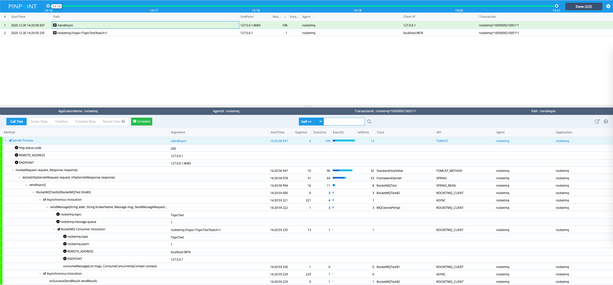

## Pinpoint RocketMQ Client Plugin

### Support Version 
- RocketMQ 4.x
 

### RocketMQ Configuration
To enable RocketMQ Producer, set the following option in *pinpoint.config*:
```
profiler.RocketMQ.producer.enable=true
```
To enable RocketMQ Consumer, set the following option in *pinpoint.config*:
```
profiler.RocketMQ.consumer.enable=true
```
To enable RocketMQ, set the following option in *profiler.rocketmq.basePackage*:
- Comma separated list of package names
- eg) profiler.rocketmq.basePackage=com.company
- eg) profiler.rocketmq.basePackage=com.company.shopping.cart, com.company.payment
```
profiler.rocketmq.consumer.basePackage=
```

### SNAPSHOT 
- SERVER MAP <br/>
  

- TRACE <br/>
  