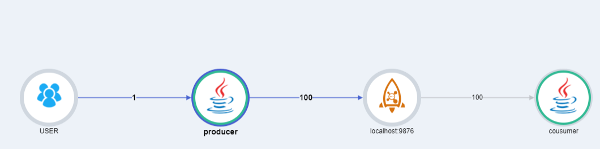

## Pinpoint RocketMQ Client Plugin

### Support Version 
- RocketMQ 4.x
 

### RocketMQ Configuration
To enable RocketMQ Producer, set the following option in *pinpoint.config*:
```
profiler.RocketMQ.producer.enable=true
```
To enable RocketMQ Consumer, set the following option in *pinpoint.config*:
```
profiler.RocketMQ.consumer.enable=true
```
To enable RocketMQ, set the following option in *profiler.rocketmq.basePackage*:
- Comma separated list of package names
- eg) profiler.rocketmq.basePackage=com.company
- eg) profiler.rocketmq.basePackage=com.company.shopping.cart, com.company.payment
```
profiler.rocketmq.consumer.basePackage=
```
### Caution
#### Caution for Consumer
In the case of a Consumer,
there is a difference between setting up to handle a single message(MessageExt) and multi message(MessageExt List), as shown in the server map.

If MessageExt List, which receives one message at a time, is the target of the trace, remote trace is enabled.   
  
(You can show the information of the producer who sent the message to the broker.)
<br><br>
If MessageExt List, which has received multiple messages at once, is the target, remote trace is disabled.


(You can not show the information of the producer who sent the message to the broker.)

- TRACE <br/>
  